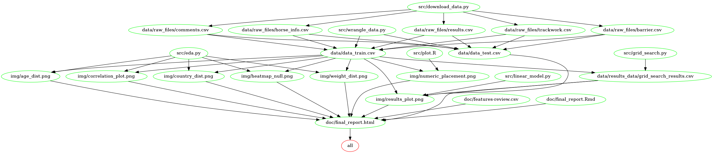

# Hong Kong Horse Race Predictor

- Authors: Derek Kruszewski, Yi Liu, Rob Blumberg, Carlina Kim

Data analysis project for Group 302 for DSCI (Data Science Workflows): a Master of Data Science Course at the University of British Columbia.

## About

This project attempts to build a regression model to answer the research question:

**Given a set of features related to racing horses, can we predict the outcome of a race?**

The model produced is able to predict finish times with an R^2 correaltion of 0.909.

The dataset used to answer this question is the _Hong Kong Horse Racing Dataset for Experts_, publicly available through Kaggle (HorseBaby 2018). This data has been rehosted on github for use with this project's scripts:

https://raw.githubusercontent.com/v5y8/horse_race_data/master

Please ensure the above github repository is used for downloading with Makefile.

## Final Report

The final report can be found [here](https://github.com/UBC-MDS/DSCI_522_Group_302/blob/master/doc/final_report.html), and can be viewed [here](http://htmlpreview.github.io/?https://github.com/UBC-MDS/DSCI_522_Group_302/blob/master/doc/final_report.html).

## Usage

There are two ways to replicate the analysis on your local machine. Either method will take 15-20 minutes to fully execute.

### Method 1: Using Docker

Note - the instructions below depends on running this in a unix shell (e.g., terminal or Git Bash), if you are using Windows Command Prompt, replace /$(pwd) with PATH_ON_YOUR_COMPUTER.

1. Install and run [Docker](https://www.docker.com/get-started)

2. Clone this Github repository and run the following command at the command line/terminal from the root directory of this project:

```
docker run --rm -v /$(pwd):/home/DSCI_522_Group_302 v5y8/group_302_environment make -C /home/DSCI_522_Group_302 all
```

3. To reset the repo to a clean slate, run the following command at the command line/terminal from the root directory of this project:

```
docker run --rm -v /$(pwd):/home/DSCI_522_Group_302 v5y8/group_302_environment make -C /home/DSCI_522_Group_302 clean
```

### Method 2: Using Make 
 
This method requires all dependencies listed below to be installed before running the analysis. Run the following command in the terminal at the root directory of this project to replicate the analysis:

```
make all
```

To reset this repository to a clean state, run the following command in the terminal at the root directory of this project:

```
make clean
```

## Dependencies diagram of Makefile

The relationships between scripts, data files, images, and final outputs are summarised in the dependency diagram below:



## Dependencies

Python 3.7.5 and Python Packages:
- [pandas 0.25.3](https://pandas.pydata.org/getpandas.html)
- [docopt 0.6.2](https://github.com/docopt/docopt)
- [numpy 1.17.4](https://numpy.org/)
- [scikit-learn 0.22](https://scikit-learn.org/stable/install.html)
- [altair 3.2.0](https://altair-viz.github.io/)
- [pandas-profiling 2.3.0](https://github.com/pandas-profiling/pandas-profiling)
- [matplotlib 3.1.1](https://matplotlib.org/)
- [seaborn 0.9.0](https://seaborn.pydata.org/)
- [selenium 3.141.0](https://pypi.org/project/selenium/)

ChromeDriver (for use with selenium package):
 - [chromedriver 80.0.3987.16](https://chromedriver.chromium.org/)

R version 3.6.1 and R packages:
- [knitr 1.27.2](https://yihui.org/knitr/)
- [tidyverse 1.2.1](https://www.tidyverse.org/)
- [docopt 0.6.1](https://github.com/docopt/docopt)

## Contributions
We welcome all contributions to this project! If you notice a bug, or have a feature request, please open up an issue [here](https://github.com/UBC-MDS/DSCI_522_Group_302/issues/new). If you'd like to contribute a feature or bug fix, you can fork our repo and submit a pull request. We will review pull requests within 7 days. All contributors must abide by our [code of conduct](https://github.com/v5y8/DSCI_522_Group_302/blob/master/CODE_OF_CONDUCT.md).

## References

<div id="refs" class="references">

<div id="ref-Dataset">

HorseBaby. 2018. “Horse Racing Dataset for Experts (Hong Kong).”
<https://www.kaggle.com/hrosebaby/horse-racing-dataset-for-experts-hong-kong>.

</div>

</div>