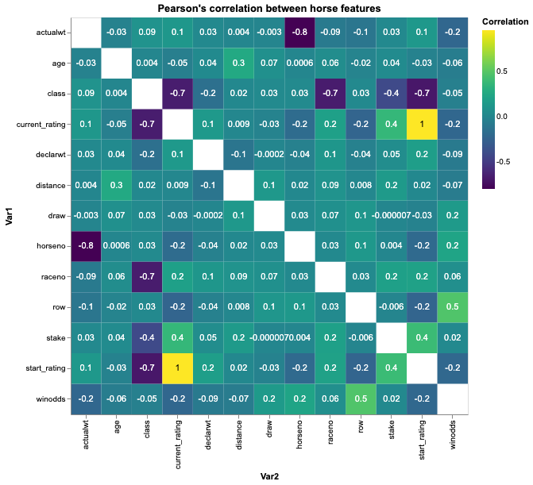
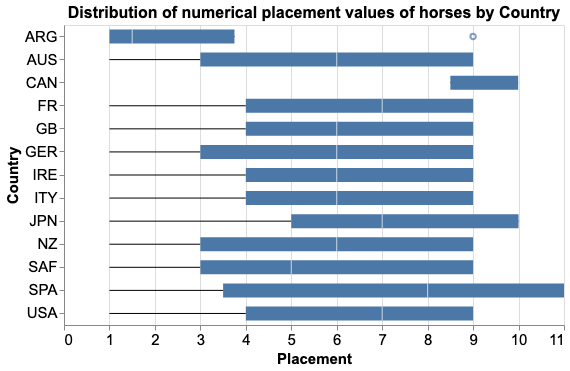
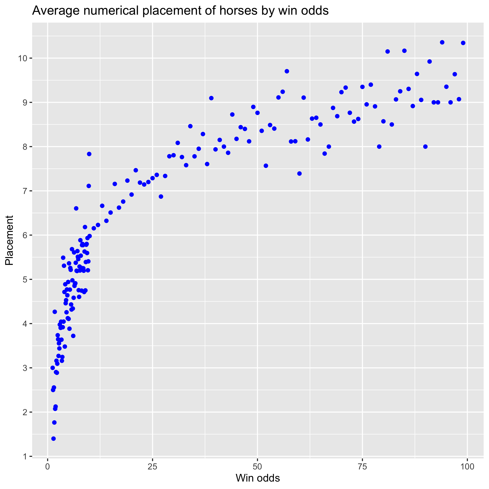

```{r setup, include=FALSE}
knitr::opts_chunk$set(echo = FALSE)
library(tidyverse)
```

## Introduction

Hong Kong horse racing bets contributed a staggering $15.8 billion USD turnover for 2017-2018 [@ng]. With such large amounts of money being wagered, it **spurs** the question: "Given a set of features related to racing horses, can we predict the outcome of a race?".

A publically available dataset with Hong Kong horse racing statistics is available on Kaggle [@Dataset] for 2015-2017. The data set author mentions that this data was compiled from The Hong Kong Jockey Club [@HKJC]. This dataset was utilized to create a predictive model for horse performance. The following report sections explore this data and comment on the success of said model.

The R and Python programming languages were used in this analysis [@R; @Python]. Python packages used in the analysis include: pandas [@mckinney-proc-scipy-2010], docopt [@docoptpython], numpy [@numpy], scikit-learn [@scikit-learn], altair [@Altair2018], pandas profiling [@pandasprofiling2019], matplotlib [@Hunter:2007], selenium [@selenium], and seaborn (citation still under development). R packages used in this analysis include: knitr [@knitr], docopt [@docopt], and tidyverse [@tidyverse].

## Exploratory Data Analysis

The data set used contains five sub sets (.csv files): `results`, `barrier`, `comments`, `horse_info`, and `trackwork`. Results contains horse racing placement information from official races (race outcomes, pre-race conditions). Comments contains text on the performance of each horse during official races, and horse_info contains specifications for the horses participating in races (features include name, country of origin, sex and age).

The barrier data set includes practice runs completed by horses. Since this information is useful in predicting future track performance, it was included along with results as race observations. The results race data contains all the same features as the barrier set; however the barrier practice runs are missing ~20% of the features that are in results such as `actualwt`, `class`, and `handicap`. In order to be able  tostudy if practice runs are biased, these practice runs are labelled in the final data set so that observations are known to be either an official race or practice. Trackwork contains warmup and exercise routines for horses throughout the time period of the data set (2015-2017). This data set was tentatively omitted because it is difficult to incorporate into the master data set. The set contains 648,000 rows. 

##### 1. Let's observe some feature relationships

To understand the 36 different featurse and their relationships, we produced a correlation plot on a selection of features. For a more in-depth description of each feature, see the Appendix section at the end of this document.

```{r pearsons correlation, warning=FALSE, out.width = "60%", fig.align = "center", echo= FALSE, fig.cap="Figure 1: Correlation heat map for select racing horse features. Note that the features shown are a subset of the full feature list, and were chosen at random."}

```

 The plot in Figure 1 shows only a few highly correlated features. The highest pair of correlated features (1) are `current_rating` and `start_rating`. `Current_rating` is the rating system for determining handicaps and `start_rating` displays the previous rating of the particular horse. There also seems to be more negatively correlated features than positively correlated ones. Some pairs to mention are `class`, which is the quality of the race (1=championship), and `race_no`, which is the race number of the day, which have a negative correlation value of -0.68. `Class` and `start_rating` have a negtive correlation value of -0.7, while `horseno`, the index number given to the horse at the race, and `actualwt`, the weight carried during the race (horse + jockey + gear), have a correlation of -0.8 . With better understanding of our features, we can remove unnecessary ones and view relationships on the more prevalent ones. This could be performed automatically using a feature selection algorithm.


##### 2. `country` and `age` distributions

```{r country distribution, warning=FALSE, out.width = "60%", fig.align = "center", echo= FALSE, fig.cap="Figure 2: Placement distributions by country. Please note that non-numeric placement values such as 'Did not Finsh' are not included in this plot."}

```

The race horses came from Argentina, Australia, Canada, France, Great Britain, Germany, Italy, Ireland, Japan, New Zealand, South Africa, Spain, and USA.

```{r age distribution, warning=FALSE, out.width = "60%", fig.align = "center", echo= FALSE, fig.cap="Figure 3: Distributions of age by country. We can see the historgram is mound-shaped, with most ages falling between 5 and 8."}
knitr::include_graphics("../img/age_dist.png")
```

The `age` of the race horses range from 3 to 10 years old.

##### 3. Relationship between `winodds` and `placement` 

```{r numerical placement, out.width = "60%", fig.align = "center", echo= FALSE, fig.cap="Figure 4: Placement by win odds. Note that win odds are estimated as (probability of winning / probability of not winning) a given race."}

```

Figure 4 above plots the average placement of the horses in a race given their win odds value. It shows that higher win odds result in worse/higher placement.

## Analysis

To answer our research question, we created a model to predict horse race times from various features in the Hong Kong horse racing dataset. As such, this consisted in a regression task, and so we set out to produce a linear regression model. 

Before taking a look at the results, the feature selection and optimization steps will be discussed. To start off, the dataset contained a mix of 36 categorical and numeric features. There were two main decisions that needed to be made with regards to these features: which ones to pick (1), and whether or not to transform our numeric features to high order polynomials (2). As it turned out, both challenges could be addressed with the same solution. First, the numeric features were transformed to 5th degree polynomials (including cross terms). Then, a recursive feature elimination (RFE) algorithm was applied, which selected which of the featues, both original and transformed, should be used to train our model. To run the RFE, the number of features to select had to be specified. Thus, a grid search was done to optimize this hyperparameter, using the $R^2$ correlation coefficent on the validation set as the scoring method. The results of the grid search are shown below.

```{r grid-search-res, warning=FALSE, message=FALSE}
results_grid_search <- read_csv("../data/results_data/grid_search_results.csv")[2:4] %>% 
                         rename("# features selected" = n_features_to_select,
                                "Mean R^2 val score" = "mean_val_score (r2)", 
                                "Fit time per fold (s)" = "fit time per fold (s)")

results_grid_search <- results_grid_search %>% 
  map_df(., function(x) round(x, 3))
knitr::kable(results_grid_search, caption = "Table 1: Mean R^2 cross validation scores and fit time per fold in a grid search optimizing the number of features to select. Note that the large fit time for # features = 22 is assumed to be due to random noise related to the internal functioning of the machine on which the grid search was performed.")
```

In the table above, we can see that after roughly 25-28 features selected, the mean R^2 validation score no longer increased. Therefore, a value of 25 was used as the number of features selected, and a linear model was trained with the 25 most predictive features given by RFE on the entire training set. The linear model was then used on the test data. The results are shown below.


```{r, out.width = "80%", echo = FALSE, fig.align = "center", fig.cap="Figure 5: Prediction results. The red line represents a theoretically perfect model as reference."}
knitr::include_graphics("../img/results_plot.png")
```

Visually, it appears as though our linear regression model performs quite well compared to the theoretically perfect model represented by the red dashed line. The R^2 score in this case was 0.909. One thing to keep in mind, however, is that the order of finishes in a horse race can come down to fractions of a second, and so even a model capable of predicting finish times with an error of less than 1s can prove to be not very useful. 

Another note to make about the results is that the prediction values seem to come in clusters. This suggests that the model may be segregating prediction values based on one feature (for instance, distance), and then fine tuning the predicted values based on other features. Therefore, the next step of this project would be to investigate this by looking more closely at the weights of our linear model. Additionally, this analysis could be extended by using predicted finish times to estimate race finish orders, and compare these predicted finishing positions to the actual ones. 

\newpage 

## Appendix

### Description of features

```{r features description, warning=FALSE, message=FALSE}
feature_desc_df <- read_csv("features-review.csv")[0:2]
                        
knitr::kable(feature_desc_df)
```

## References
